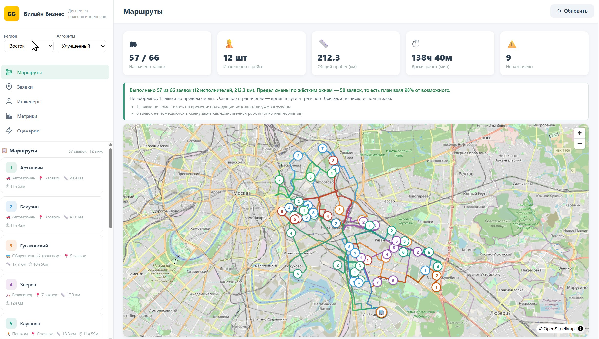
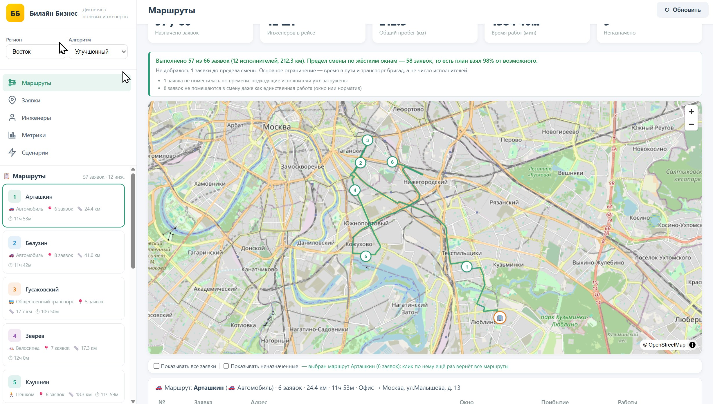
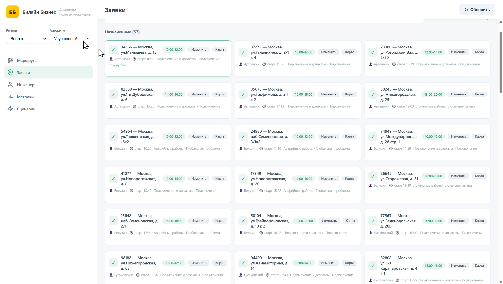
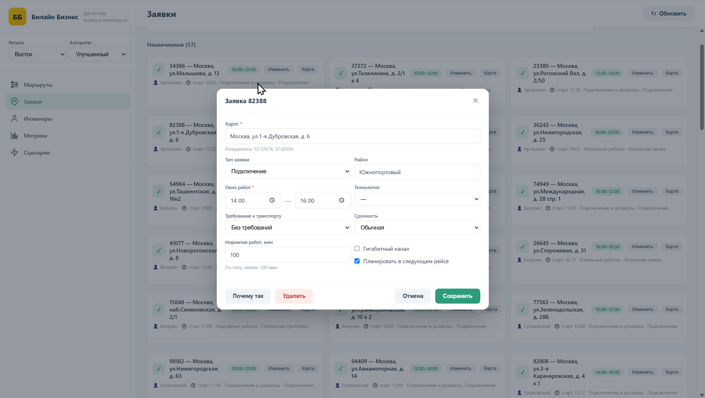

# Билайн Бизнес — диспетчерское планирование сервисных бригад

Веб-приложение для хакатона ЛЦТ 2026. Загружает тестовые датасеты заявок трёх
регионов, распределяет их между инженерами, строит маршруты по смене и
показывает план на карте — с объяснениями для диспетчера.

## Скриншоты

**Главное окно: план на карте, сводка и сравнение с базовым алгоритмом**



**Маршрут одного инженера: стопы, времена приезда и начала работ**



**Меню заявки: карточка с адресом, окном, навыком и нормативом**



**Добавление и изменение заявки прямо в интерфейсе**



## Что сделано

- **Планирование смены.** Заявки распределяются между инженерами с учётом
  навыков, типа транспорта, временных окон заказчиков, границ смены 08:00–20:00
  и нормативов времени работ. Порядок обхода внутри смены оптимизируется.
- **Четыре независимых алгоритма** в одном селекторе, сравнение в один клик:
  базовый FIFO, рабочий `improved`, OR-Tools Routing и режим «Контур»
  (с возвратом инженера в офис и дорожной матрицей OSRM).
- **Маршруты по дорогам на карте** (MapLibre + OpenStreetMap): полилинии OSRM,
  стопы, офис, неназначенные заявки; переключатель «все маршруты / один
  инженер» и легенда статусов. Есть запасной вариант «прямая линия».
- **Объяснения по каждой заявке.** Клик открывает: кто взял заявку, на какую
  позицию, почему именно этому инженеру, кто ещё мог взять и с каким добавленным
  пробегом. Для неназначенных — точная причина кодом и что помогло бы её
  выполнить.
- **Правка данных в интерфейсе** с записью в базу: новая заявка по адресу или
  кликом по карте, правка и отмена существующих, правка смены/навыков/
  транспорта инженера, счётчик изменений и возврат к импорту по галочкам.
- **Сводка по плану** над картой: выполнено заявок, предел смены по жёстким
  окнам, доля от возможного, ограничения, которые встали на пути.
- **Сценарии перепланирования** (срочная заявка, отмена, недоступный инженер) с
  человекочитаемым diff: план пересчитывается на сервере, но **данные в БД не
  меняются** — эффект живёт только до перезагрузки страницы.
- **Сравнение с базовым алгоритмом** по заявкам, пробегу и времени — считается
  автоматически на тех же данных и показывается во вкладке «Сравнение».
- **API по фиксированному контракту** — солвер можно заменить, не трогая фронт.

## Соответствие ТЗ

| Требование | Как выполнено |
|---|---|
| 2.1.1 Загрузка тестовых данных | CSV/JSON → SQLite, импорт одной командой, три региона |
| 2.1.2 Распределение заявок | четыре солвера, навыки + транспорт + жёсткие окна + границы смены |
| 2.1.3 Порядок посещения адресов | вставка по добавочному пробегу + 2-opt, либо OR-Tools |
| 2.1.4 Маршруты и точки на карте | MapLibre + OSM, полилинии OSRM, стопы и офис |
| 2.1.5 Краткая информация о плане | карточка маршрута: кто, куда, в какое время едет |
| 2.1.6 Перестроение после события | срочная заявка / отмена / недоступный инженер + diff (предпросмотр) |
| 2.1.7 Объяснение результата | `/api/explain` и карточка в интерфейсе: назначение и отказ |
| 2.2 Обязательные ограничения | смена, окна, порядок поступления, срочность, гигабит → авто |
| 2.3 Критерии оптимальности | больше назначенных → меньше бригад → меньше пробега; потолок смены |
| 2.4 Формат входных данных | справочники в `app/regions.py`, описание в документации |
| 3.2 Программные требования | Python 3.11+, FastAPI, без обязательных тяжёлых зависимостей |
| 4. Демонстрация | сценарий прохождения — в разделе «Документация» |

## Как запустить

```bash
py -3 -m venv .venv                  # Windows
.venv\Scripts\activate
pip install -r requirements.txt
pip install -r requirements-benchmark.txt   # для двух режимов на OR-Tools

py -m app.db import                   # залить CSV в базу (мгновенно)
uvicorn server:app --reload           # http://localhost:8000
```

При пустой базе импорт происходит сам при старте. Через Docker:

```bash
docker compose up --build            # http://localhost:8000
```

## Замеры

`python -m app.bench` — три региона × четыре режима, медиана прогонов. Смена
08:00–20:00. «Потолок» — сколько заявок в принципе назначаемо при жёстких окнах.

| Регион | Заявок | Потолок | FIFO | `improved` | OR-Tools | «Контур» |
|---|---|---|---|---|---|---|
| Восток | 66 | 58 | 39 | **57** | 57 | 54 |
| Юго-восток | 83 | 77 | 39 | **62** | 59 | 57 |
| Юго-центр | 56 | 48 | 28 | **48** | 46 | 46 |

Выводы, которые мы считаем честными:

- `improved` закрывает потолок смены на 100 % на Востоке и Юго-центре и на 80 %
  на Юго-востоке. Разрыв с потолком — это время в пути при медленном транспорте,
  а не качество алгоритма.
- OR-Tools при том же покрытии тратит на 20–25 % меньше пробега, но на двух
  регионах оставляет на 2–3 заявки меньше рабочего `improved`. Эталон нужен,
  чтобы было с чем сравнивать, — поэтому он остаётся в проекте отдельным режимом.
- FIFO отстаёт от `improved` на 18–20 заявок — это и есть требуемое ТЗ сравнение
  с базовым алгоритмом, оно считается автоматически.
- Пробег «Контура» нельзя сравнивать с остальными напрямую: дорожная матрица
  даёт примерно в 1.5 раза больше километров, чем прямая, и сверху платится
  возвращение в офис. Сопоставимы только число назначенных заявок и порядок
  обхода.

Разбор замеров, влияние лимитов поиска и отклонённые гипотезы — в
[`docs/замеры.md`](docs/замеры.md).

## Тестовый набор данных

Три синтетических региона — `vostok`, `yugo_vostok`, `yugocentr` — по 66, 83 и 56
заявок. Заявки различаются навыком (подключение, локальные работы, аварийные),
приоритетом, окнами заказчика, требованием к транспорту и наличию гигабита.
Отдельно импортируется контрольное распределение — ориентир, с которым
сравнивается фактический план. Справочники (навыки, нормативы, транспорт)
вынесены в `app/regions.py` и описаны в документации.

## Стек

FastAPI + Pydantic, SQLAlchemy (SQLite по умолчанию, PostgreSQL — сменой
`DATABASE_URL`), геокодинг Nominatim с кэшем и фолбэком на центры районов, карта
MapLibre + растровые тайлы OpenStreetMap, дорожная геометрия OSRM. Планировщик —
собственные эвристики без тяжёлых зависимостей; OR-Tools ставится отдельно и
нужен только для двух дополнительных режимов.

## Известные ограничения

- **Сценарии не меняют БД.** Вкладка «Сценарии» пересчитывает план на сервере и
  показывает diff, но **данные в БД не меняются**: ни отменённая заявка, ни
  срочная заявка, ни недоступный инженер не записываются. После перезагрузки
  страницы, смены региона или правки любой заявки сценарий исчезает, и план
  возвращается к исходному. Постоянные изменения вносятся в редакторе данных —
  галочка «Планировать в следующем рейсе» пишется в БД, и снятие этой галочки
  возвращает заявку в рейс.
- Пробег и время в пути в расчёте считаются по haversine с коэффициентом
  кривизны дорог. Дорожная геометрия для карты включается отдельно
  (`OSRM_ENABLED`, по умолчанию включено). Исключение — режим «Контур»: он берёт
  у OSRM матрицу расстояний и считает расписание по ней, то есть единственный
  режим, который при расчёте ходит в сеть; матрица кэшируется целиком на регион,
  а при недоступности OSRM режим считает по прямой и помечает это в ответе.
- Принимается только агрегированный транспорт (тип инженера); гигабит-фильтр по
  огр.
- Статусы заявок при импорте из CSV пустые: контрольный и синтетический наборы не
  имеют общих идентификаторов, привязать статус честно не к чему.
- Организованного хранения истории планов и настроек нет — это следующая итерация.

## Дальнейшее развитие

- Кнопка «Применить» у сценариев — записывать событие в БД, а не только
  показывать пересчитанный план.
- Хранить историю планов и сравнивать не только с базовым алгоритмом, но и с
  предыдущим прогоном.
- Разнести офис и депо: сейчас это одна точка, отдельное депо позволит считать
  утреннюю развозку и дневной объезд раздельно.
- Учесть в оптимизации реальный парк: состав транспорта влияет на пробег сильнее,
  чем настройки солвера.
- Автотесты на регресс метрик вместо ручного `app.bench` в каждой итерации.

## Документация

- [`docs/справочник.md`](docs/справочник.md) — настройки, API-контракт, таблицы БД
- [`docs/как-работает-решение.md`](docs/как-работает-решение.md) — путь от заявки
  до маршрута, проверка ограничений, почему выбран рабочий режим
- [`docs/замеры.md`](docs/замеры.md) — метрики, лимиты поиска, отклонённые гипотезы
- [`docs/мап-два-движка-ТЗ.md`](docs/мап-два-движка-ТЗ.md) — история выбора
  картографической библиотеки
- Сценарий демонстрации по шагам ТЗ — в корне репозитория, файл
  `СЦЕНАРИЙ-ДЕМО.md`
